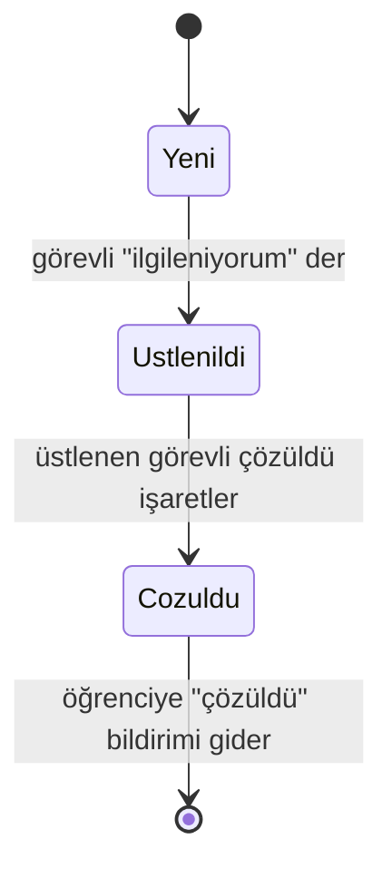
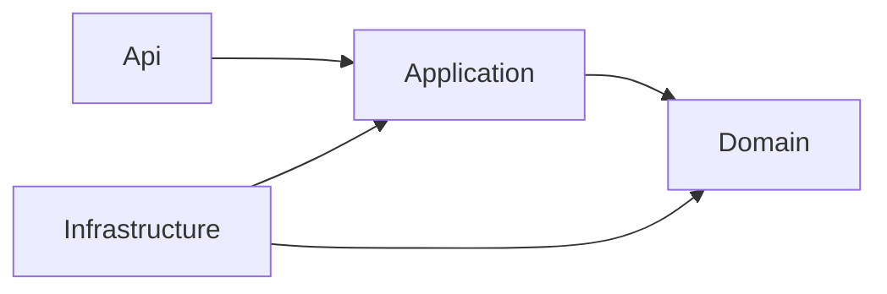

# Campus Report

**Kampüs sorun bildirim sistemi.** Öğrenci kampüste gördüğü sorunu fotoğraf ve konumla bildirir, görevli "ilgileniyorum" diyerek üstlenir ve çözer, çözülünce öğrenciye sistemde haber gider.

*Yapay Zeka Destekli Yazılım Geliştirme dersi dönem projesi. Dört kişilik ekip: Hüseyin Emre, Yusuf Ekenel, Murat Yaman, Ertuğrul Pekdemir.*

> **Durum (1 Ekim 2026):** Proje fikri hocaya iletildi, hoca olumlu yanıt verdi ("faydalı ve çevreci", teknoloji seçimi "yerinde"; 1 Ekim e-postası); hoca projeyi takımla yürütmemizi önerdi, ekip kuruldu. Bu repo'da henüz **proje kodu yok**; tasarım, dokümantasyon ve izleme sistemi var. Aşağıdaki teknoloji seçimleri **öneridir**, kesinleşince güncellenir. Kurulum ve çalıştırma bölümleri kod eklenince tamamlanacaktır.

## Ekip ve çalışma düzeni

Hoca projenin ekiple ve GitHub üzerinde, branch ve Pull Request ile yürütülmesini istedi; kodları ve kimin ne yaptığını soracağını söyledi. Ders cuma günleri; dönem 15 ders haftası, şu an 3. haftadayız. Ekibe yeni katılan: [Başlangıç rehberi](proje-bilgileri/ekip/00-baslangic-rehberi.md).

| Kişi | Rol (öneri) | Ana sorumluluk |
| --- | --- | --- |
| Hüseyin Emre | Teknik lider | `domain`, `application`, `contracts`, CI, kabul testleri, PR incelemesi |
| Ertuğrul Pekdemir | Veri ve altyapı | PostgreSQL, SQL şeması, dosya depolama; yeni bildirim ekranı |
| Murat Yaman | Sunucu (API) | Endpoint'ler, kimlik doğrulama, hata eşleme; görevli ekranları |
| Yusuf Ekenel | Uygulama ve test | Test senaryoları, sahte veri; öğrenci ekranları |

**Kurallar:** `main`'e doğrudan commit yok; her iş kendi branch'inde küçük PR ile gelir, en az bir kişi inceler. Herkes her hafta en az bir anlamlı commit atar. Commit mesajı önekli ve Türkçe (`feat:`, `fix:`, `docs:`, `test:`). Şifre, token ve gerçek öğrenci verisi repo'ya girmez. Haftalık hedefler, kişi bazlı görevler ve takvim: [Ekip ve 15 haftalık yol haritası](proje-bilgileri/10-ekip-ve-yol-haritasi.md).

## İçindekiler

1. [Proje nedir?](#1-proje-nedir)
2. [Problem ve amaç](#2-problem-ve-amaç)
3. [Nasıl çalışır?](#3-nasıl-çalışır)
4. [Özellikler ve kapsam](#4-özellikler-ve-kapsam)
5. [Mimari](#5-mimari)
6. [Teknoloji yığını](#6-teknoloji-yığını)
7. [Domain modeli ve kurallar](#7-domain-modeli-ve-kurallar)
8. [API özeti](#8-api-özeti)
9. [Güvenlik ve gizlilik kararları](#9-güvenlik-ve-gizlilik-kararları)
10. [Kurulum ve çalıştırma](#10-kurulum-ve-çalıştırma)
11. [Test stratejisi](#11-test-stratejisi)
12. [Kod kalitesi](#12-kod-kalitesi)
13. [Geliştirme yöntemi ve Git akışı](#13-geliştirme-yöntemi-ve-git-akışı)
14. [Yapay zeka kullanımı](#14-yapay-zeka-kullanımı)
15. [Zorluklar ve çözümler](#15-zorluklar-ve-çözümler)
16. [Proje durumu ve yol haritası](#16-proje-durumu-ve-yol-haritası)
17. [Dokümantasyon haritası](#17-dokümantasyon-haritası)
18. [Lisans](#18-lisans)

## 1. Proje nedir?

| | |
| --- | --- |
| İsim | Campus Report |
| Tür | Ders projesi (canlı demo ve sunum için; üretim sistemi değil) |
| Ölçek | Tek kampüs, en fazla birkaç yüz kullanıcı |
| İstemci | Flutter (Dart) |
| Sunucu | Dart (Shelf), öneri |
| Veritabanı | PostgreSQL 16, öneri |
| Geliştirme yaklaşımı | Önce spec, sonra feature branch ile küçük iterasyonlar |
| Ayrıntı | [Proje kapsamı ve amacı](proje-bilgileri/01-project-scope.md) |

## 2. Problem ve amaç

**Problem (varsayım).** Kampüste bir sorunla karşılaşan kişi (yanmayan bir lamba, kırık bir kapı) sorunu kime ve nereden bildireceğini bilmeyebilir. Bildirim çoğu zaman sözlü veya mesajla gider: kaydı, fotoğrafı ve konumu olmaz; görevli yerini bulmakta zorlanır; aynı işe birden fazla kişi gidebilir ya da kimse gitmez; bildiren kişi sorunun çözülüp çözülmediğini öğrenemez. Bu problem gerçek bir kurumun sürecine değil, ders için modellenen bir senaryoya dayanır.

**Amaç.** Sorunun bildirilmesinden çözülmesine kadar olan yolu **kayıt altına alınmış, izlenebilir ve tek sahipli** hale getirmek.

| Hedef | Nasıl karşılanır |
| --- | --- |
| Sorun net bildirilsin | Fotoğraf, kategori, açıklama ve kampüs içi konum zorunlu |
| Görevli yerini bilsin | Konum bildirimle birlikte kaydedilir |
| Aynı işe iki kişi gitmesin | Bir bildirimi aynı anda tek görevli üstlenir |
| Bildiren haberdar olsun | Çözülünce öğrenciye sistemde bildirim gider |
| Süreç izlenebilir olsun | Her durum değişimi kayıt altına alınır |
| Kişisel veri korunsun | EXIF temizleme, rol tabanlı erişim |

**Öğrenme hedefleri.** Yapay zeka ile geliştirmede çıktıyı okuyup doğrulamak (Vibe Coding değil Agentic Engineering); statik analiz ve Pull Request incelemesiyle kaliteyi ölçmek; katmanlı mimari, test edilebilirlik ve güncel dokümantasyon alışkanlığı kazanmak.

## 3. Nasıl çalışır?

1. Öğrenci giriş yapar, sorunun fotoğrafını çeker, konumu ve kategoriyi seçer, gönderir.
2. Sistem doğrular (konum kampüs içinde mi, fotoğraf jpeg/png ve 5 MB altında mı) ve bildirimi `Yeni` olarak kaydeder.
3. Görevli listeyi açar, bir bildirimi "ilgileniyorum" diyerek üstlenir; bildirim `Ustlenildi` olur, başkası üstlenemez.
4. Görevli çözünce `Cozuldu` işaretler (isteğe bağlı notla).
5. Aynı işlemde, bildirimi açan öğrenciye "çözüldü" bildirimi oluşur.



Roller: **Student** (bildirim açar, kendi bildirimlerini görür) ve **Staff** (listeler, üstlenir, çözer).

## 4. Özellikler ve kapsam

**İlk sürümde olacaklar (planlanan):**

- E-posta ve parola ile giriş, iki rol
- Fotoğraflı ve konumlu sorun bildirimi
- Görevlinin bildirimleri listelemesi, üstlenmesi, çözüldü işaretlemesi
- Öğrenciye uygulama içi "çözüldü" bildirimi ve okunmamış sayısı
- Öğrencinin kendi bildirimlerini ve durumlarını görmesi

**İlk sürümde olmayacaklar:** push bildirimi, puan ve yorum, yeniden açma, kayıt ol ekranı (hesaplar seed veriden), yönetici paneli, otomatik atama, harita ısı görünümü, yapay zeka ile kategori önerisi, çoklu kampüs. Gerekçeler: [kapsam](proje-bilgileri/01-project-scope.md#6-kapsam).

**Bilinçli sadeleştirmeler (kapsam ve ölçek):** tek sunucu, tek veritabanı; mikroservis, mesaj kuyruğu ve önbellek yok. Birkaç yüz kullanıcı için bunlar gereksiz karmaşıklık borcu olurdu.

## 5. Mimari

Katmanlı mimari; bağımlılıklar içe doğru akar.



| Katman | Sorumluluk |
| --- | --- |
| Domain | Varlıklar, değer nesneleri, iş kuralları; hiçbir katmana bağlı değil |
| Application | Kullanım senaryoları (servisler) ve arayüzler (repository, dosya depolama) |
| Infrastructure | PostgreSQL ve dosya sistemi gerçeklemeleri |
| Api | HTTP endpoint'leri, kimlik doğrulama, hata eşleme |

Bağımlılıklar arayüzle verilir; bağlama `main.dart` içinde yapılır. Zengin domain nesnesi: doğrulama `Create` metodunda, geçersiz nesne oluşamaz. İlkeler: SOLID, Clean Code. Ayrıntı: [mimari genel bakış](proje-bilgileri/02-architecture-overview.md).

## 6. Teknoloji yığını

| Konu | Seçim | Durum |
| --- | --- | --- |
| İstemci | Flutter (Dart 3.13.0, Flutter 3.47.0) | Kabul |
| Sunucu | Dart (Shelf) | Öneri, [ADR-01](proje-bilgileri/adr/01-dart-backend-postgresql.md) |
| Veritabanı | PostgreSQL 16 | Öneri |
| Veritabanı erişimi | `postgres` paketi, parametreli sorgu | Öneri |
| Şema yönetimi | Elle SQL dosyaları (`db/migrations/`) | Öneri |
| Test | Dart `test`, `mocktail`; entegrasyon testi gerçek PostgreSQL konteyneriyle | Öneri |
| Konteyner | Podman, podman-compose | Kabul |
| Kod kalitesi | Yerelde `dart analyze`, `flutter analyze`, kapsam; PR'da SonarQube Cloud (ücretsiz plan) | Öneri, [ADR-02](proje-bilgileri/adr/02-kalite-araci-sonarqube-cloud.md); yerel Community'de Dart yok (doğrulandı), Cloud denenmedi |
| Dağıtım | VPS üzerinde compose, HTTPS | Planlandı |

Paket sürümleri pub.dev'de kontrol edildikten sonra eklenecek. Değişiklik geçmişi: [teknoloji değişiklikleri](proje-bilgileri/kayitlar/teknoloji-degisiklikleri.md).

## 7. Domain modeli ve kurallar

Varlıklar: **User**, **Report** (aggregate root; **Photo** ve **Location** değer nesneleri), **Notification**, **StatusHistory**.

| Kural | Özet |
| --- | --- |
| Rule 00 | Yalnızca Staff üstlenir ve çözüldü işaretler |
| Rule 01 | Student yalnızca kendi bildirimlerini ve haberlerini görür |
| Rule 02 | Bir bildirimi aynı anda tek görevli üstlenir (`409`); veritabanında koşullu güncelleme |
| Rule 03 | Çözüldü işaretini yalnızca üstlenen görevli yapar |
| Rule 04 | Çözülünce öğrenciye bir kez bildirim; durum ve bildirim aynı işlemde yazılır |
| Rule 05 | Yalnızca diyagramdaki durum geçişleri geçerli |
| Rule 06 | Kampüs dışı konumda bildirim oluşturulmaz |
| Rule 07 | Fotoğraf jpeg/png, en fazla 5 MB; dosya adını sunucu üretir; EXIF temizlenir |

Alan tabloları ve örnek veri: [domain tasarımı](proje-bilgileri/03-domain-design.md). Hikayeler ve kabul ölçütleri: [kullanıcı hikayeleri](proje-bilgileri/04-user-stories.md).

## 8. API özeti

| Endpoint | Metot | Rol |
| --- | --- | --- |
| `/api/auth/login` | POST | Herkes |
| `/api/reports` | POST | Öğrenci |
| `/api/reports` | GET | Görevli |
| `/api/me/reports` | GET | Öğrenci |
| `/api/reports/{id}` | GET | İlgili öğrenci veya görevli |
| `/api/reports/{id}/assignment` | PUT | Görevli |
| `/api/reports/{id}/resolution` | PUT | Üstlenen görevli |
| `/api/me/notifications` | GET | Öğrenci |
| `/api/me/notifications/{id}/read` | PUT | Öğrenci |
| `/health` | GET | Herkes |

Hata biçimi: `{ "error": { "code", "message", "details" } }`. Durum kodları: 400, 401, 403, 404, 409, 422 (öneri). Örnek `curl` istekleri ve yanıtlar: [API tasarımı](proje-bilgileri/05-api-design.md).

## 9. Güvenlik ve gizlilik kararları

| Risk | Karar |
| --- | --- |
| Fotoğrafta kişi görünebilir | Ekranda uyarı |
| Fotoğraf dosyasında konum (EXIF) | Yüklemede temizlenir |
| Konum kişisel veridir | Yalnızca bildirim anında ve kampüs içindeyse alınır |
| Yetkisiz erişim | Rol tabanlı yetki, sunucu tarafında her endpoint'te |
| Spam | İstek hız sınırı |
| Zararlı dosya | Yalnızca jpeg/png, en fazla 5 MB, sunucu adı üretir |
| Gizli bilgi sızması | Sırlar yalnızca `.env`; repo'ya girmez |
| Parola | Güvenli hash (bcrypt veya argon2) |
| SQL Injection | Yalnızca parametreli sorgu |

Tümü: [güvenlik ve gizlilik](proje-bilgileri/06-security-and-privacy.md). Demo ve testte yalnızca sahte veri kullanılır.

## 10. Kurulum ve çalıştırma

> Kod henüz yok; bu bölüm kod eklenince gerçek komutlarla tamamlanacaktır. Aşağıdakiler **planlanan** biçimdir.

**Gereksinimler**

| Araç | Sürüm |
| --- | --- |
| Dart | 3.13.0 |
| Flutter | 3.47.0 |
| Podman ve podman-compose | 5.8.7 ve 1.6.0 |
| Git | 2.55.0 |

**Planlanan adımlar**

```bash
podman compose up -d        # PostgreSQL ve SonarQube
cp .env.example .env        # değişkenleri doldur
```

**Yapılandırma (planlanan)**

| Değişken | Varsayılan | Açıklama |
| --- | --- | --- |
| `DATABASE_URL` | (yok) | PostgreSQL bağlantı adresi |
| `PORT` | `8080` | Sunucu portu |
| `CAMPUS_BOUNDS` | (yok) | Kampüs sınırı (dikdörtgen koordinatları) |
| `PHOTO_DIR` | (yok) | Fotoğrafların saklanacağı klasör |

Ortam ayrıntısı: [geliştirme ortamı](proje-bilgileri/07-development-environment.md).

## 11. Test stratejisi

- **Birim testleri:** domain ve servisler, her kural için.
- **Entegrasyon testi:** gerçek PostgreSQL konteyneriyle, uçtan uca akış.
- **Yarış durumu testi:** iki görevli aynı anda üstlenmeye çalışınca yalnızca biri başarılı olur.
- **Sıfır veri testi:** sistem boşken listeler boş döner.
- **Geliştirme döngüsü:** Red, Green, Refactor. Test adlandırma: `Metot_Senaryo_BeklenenSonuc`.

Ayrıntı: [geliştirme süreci](proje-bilgileri/08-development-process.md#test).

## 12. Kod kalitesi

Her kod commit'inden sonra statik analiz yapılır ve puanlar kayıt altına alınır. Bulgular toplu değil tek tek çözülür; her bulgu için izlenen yol kaydedilir.

| Ölçüt | Durum |
| --- | --- |
| SonarQube | Çalışıyor (Community 26.9.0.129388, 30 Eylül'de doğrulandı); henüz kod olmadığı için tarama yapılmadı |
| SonarQube Dart desteği | Yerel Community'de **yok**; Developer Edition ve SonarQube Cloud'da var, ücretsiz Cloud planı öneriliyor ([araştırma](proje-bilgileri/kayitlar/sonarqube-puanlari.md#dart-desteği-araştırması-2026-09-30)) |
| Coverage | Henüz ölçülmedi |

Puanlar ve bulgu günlüğü: [SonarQube puanları](proje-bilgileri/kayitlar/sonarqube-puanlari.md).

## 13. Geliştirme yöntemi ve Git akışı

**Önce spec, sonra küçük iterasyonlar.** Waterfall değil: her commit sonrası tarama ve her PR'da inceleme, "en sonda test" mantığıyla çelişir.

**Feature branch mantığıyla geliştirme:**

- `main` doğrudan değiştirilmez; her zaman incelenmiş ve çalışır durumdadır.
- Her özellik, düzeltme veya doküman işi kendi branch'inde yapılır: `feature/<konu>`, `fix/<konu>`, `docs/<konu>`, `test/<konu>`.
- Küçük Pull Request, inceleme, birleştirme; branch silinir.
- Commit mesajları önek taşır: `feat:`, `fix:`, `docs:`, `test:`, `refactor:`.
- **Her PR açıklaması bir kayıttır** (şablon: ne yapıldı, nasıl test edildi, yapay zeka kullanımı, doküman). Herkes kendi haftalık günlüğünü kendi plan dosyasına yazar: [kayıt sistemi](proje-bilgileri/10-ekip-ve-yol-haritasi.md#6-kayıt-sistemi).
- Haftalık düzenli commit; toplu son gece push'u yoktur.

## 14. Yapay zeka kullanımı

**Araçlar:** Claude Code (Claude Haiku 4.5 ve Sonnet 5.x). **Kullanılan Skill'ler:** `obsidian-cli`, `obsidian-bases`, `superpowers:brainstorming`. **Otomatik etkin:** `ponytail`, `using-superpowers`. **Planlanan:** TDD, doğrulama ve inceleme Skill'leri (kodlama aşamasında). **Değerlendirilen:** Graphify (bilgi grafiği), kod oluşunca denenecek.

Çalışma ilkeleri: yapay zekaya proje bağlamı verilir (gereksiz karmaşıklık üretmesin); küçük parçalar istenir; çıktının özeti ve varsayımları önce okunur; sır ve kişisel veri prompt'lara girmez; anlaşılmayan kod projeye alınmaz; yapay zekanın yazdığı test ve ADR taslak sayılır.

Her Skill'in **ne olduğu, neden var olduğu ve projede neden kullanıldığı** [Skill kataloğunda](proje-bilgileri/kayitlar/skill-katalogu.md); haftalık kullanım (hangi Skill, nerede, neden, sonuç) [kullanım günlüğünde](proje-bilgileri/kayitlar/skill-ve-arac-kullanimi.md). Ortam tarafından otomatik etkinleştirilen `ponytail` ve `using-superpowers` de orada belirtilmiştir. Diğer: [yapay zeka kullanımı](proje-bilgileri/09-ai-usage.md).

## 15. Zorluklar ve çözümler

Yapılan hatalar ve düzeltmeleri [hata kayıtlarında](proje-bilgileri/kayitlar/hata-kayitlari.md) tutulur. Şimdiye kadarki örnekler:

| Zorluk | Çözüm |
| --- | --- |
| Yapay zeka kaynakta olmayan bir bağlantı uydurdu | Yalnızca depodaki dosyalar kaynak alındı; her iddiaya kaynak yazılıyor |
| Katman diyagramında bağımlılık yönü ters yazıldı | Ders materyalindeki tanımla karşılaştırıp düzeltildi |
| Çıkarım, kural gibi sunuldu | "Ders söyledi" ile "çıkarım" ayrımı yazılıyor |
| Doküman bağlantıları kırıktı | Obsidian CLI taramasıyla bulundu ve düzeltildi |
| Kişisel notların herkese açık repo'da olma riski | Ayrı ve ignore edilen bir klasöre taşındı |

## 16. Proje durumu ve yol haritası

| Hafta | Hedef | Durum |
| --- | --- | --- |
| 2 | Proje yaklaşımı, Git akışı, proje adayı | Tamamlandı |
| 3 | Fikir onayı, dokümantasyon, kayıt sistemi, repo iskeleti | Devam ediyor |
| 4-5 | Domain ve Application katmanı, testler | Planlandı |
| 6-7 | PostgreSQL, API, entegrasyon testi | Planlandı |
| 8+ | Flutter ekranları, SonarQube ve kalite, ADR'lar, canlıya alma, sunum | Planlandı |

Gerçek ilerleme: [haftalık kayıtlar](proje-bilgileri/haftalik/00-haftalik-index.md). Takvim, dönem süresi ve takım büyüklüğü netleşince güncellenir.

## 17. Dokümantasyon haritası

Tüm dokümanlar `proje-bilgileri/` klasöründedir; nasıl inceleneceği ve kimin nereden başlayacağı: [vault rehberi](proje-bilgileri/README.md), doküman listesi: [`00-index.md`](proje-bilgileri/00-index.md). Klasör [Obsidian](https://obsidian.md) vault'u olarak da açılabilir; bağlantılar standart Markdown olduğu için GitHub'da da çalışır.

| Grup | Dosyalar |
| --- | --- |
| Tasarım | [Kapsam](proje-bilgileri/01-project-scope.md), [Mimari](proje-bilgileri/02-architecture-overview.md), [Domain](proje-bilgileri/03-domain-design.md), [Hikayeler](proje-bilgileri/04-user-stories.md), [API](proje-bilgileri/05-api-design.md), [Güvenlik](proje-bilgileri/06-security-and-privacy.md), [Ortam](proje-bilgileri/07-development-environment.md), [Süreç](proje-bilgileri/08-development-process.md), [AI kullanımı](proje-bilgileri/09-ai-usage.md), [Ekip ve yol haritası](proje-bilgileri/10-ekip-ve-yol-haritasi.md), [Kod mimarisi ve korumalar](proje-bilgileri/11-kod-mimarisi-ve-korumalar.md) |
| Kararlar | [ADR-01](proje-bilgileri/adr/01-dart-backend-postgresql.md), [ADR-02](proje-bilgileri/adr/02-kalite-araci-sonarqube-cloud.md), [ADR şablonu](proje-bilgileri/adr/00-adr-template.md) |
| İzleme | [Haftalık](proje-bilgileri/haftalik/00-haftalik-index.md), [Başlangıç rehberi](proje-bilgileri/ekip/00-baslangic-rehberi.md), [Teknoloji değişiklikleri](proje-bilgileri/kayitlar/teknoloji-degisiklikleri.md), [Hata kayıtları](proje-bilgileri/kayitlar/hata-kayitlari.md), [SonarQube puanları](proje-bilgileri/kayitlar/sonarqube-puanlari.md), [Araç kayıtları](proje-bilgileri/kayitlar/skill-ve-arac-kullanimi.md) |

Doküman kuralı: dokümanlar her Pull Request'te güncellenir; ADR'lar silinmez.

## 18. Lisans

MIT, bkz. [LICENSE](LICENSE).
