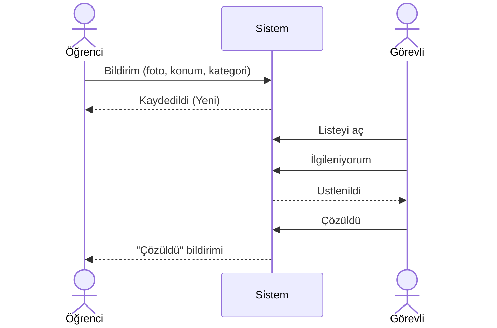
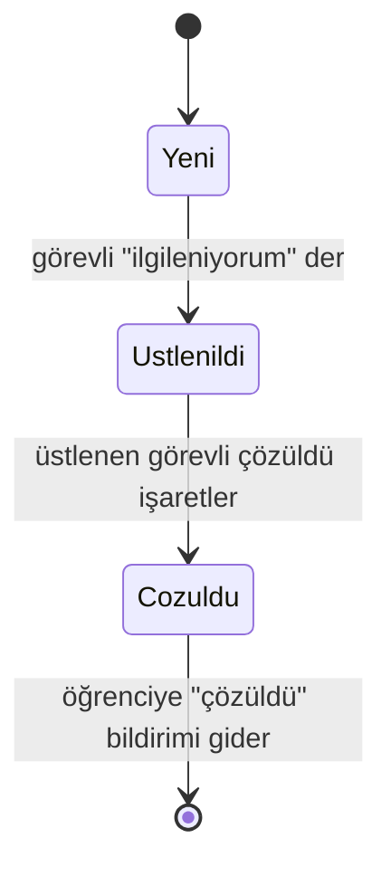

# Proje Kapsamı ve Amacı

← [İndeks](00-index.md)

Bu doküman projenin **neden** var olduğunu, **kimin için** yapıldığını, **neyi çözdüğünü** ve **nerede durduğunu** anlatır. Teknik ayrıntılar ilgili dokümanlara bağlanmıştır.

## 1. Tek cümlede

**Campus Report:** öğrencinin kampüste gördüğü sorunu (arıza, tehlike, temizlik) fotoğraf ve konumla bildirdiği, görevlinin "ilgileniyorum" diyerek üstlenip çözdüğü ve çözülünce öğrenciye sistemde haber gittiği bir sorun bildirim sistemi.

| | |
| --- | --- |
| İsim | Campus Report |
| Tür | Ders projesi (Yapay Zeka Destekli Yazılım Geliştirme) |
| İstemci | Flutter (Dart) |
| Sunucu | Dart (Shelf) ve PostgreSQL, öneri: [ADR-01](adr/01-dart-backend-postgresql.md) |
| Geliştirme yaklaşımı | Feature branch ile küçük iterasyonlar, spec önce ([süreç](08-development-process.md)) |
| Durum | Hoca olumlu yanıt verdi (1 Ekim 2026), dört kişilik ekip kuruldu |

## 2. Problem

Kampüste bir sorunla karşılaşan kişi (yanmayan bir lamba, kırık bir kapı, dökülmüş bir sıvı) sorunu **kime, nasıl ve nereden** bildireceğini bilmeyebilir. Genel durum şu risklere açıktır:

- Bildirim bir kişiye sözlü veya mesajla gider; kaydı, konumu ve fotoğrafı olmaz.
- Görevli sorunun **tam yerini** bulmakta zorlanır.
- Aynı soruna birden fazla görevli gidebilir ya da hiçbiri gitmez.
- Bildiren kişi sorunun **çözülüp çözülmediğini** öğrenemez.

> Bu problem tanımı bir varsayımdır; gerçek bir kurumun mevcut sürecine dayanmaz. Ders projesi olarak modellenen bir senaryodur.

## 3. Amaç ve hedefler

**Ana amaç:** sorunun bildirilmesinden çözülmesine kadar olan yolu **kayıt altına alınmış, izlenebilir ve tek sahipli** hale getirmek.

| Hedef | Nasıl karşılanır | Nasıl doğrulanır |
| --- | --- | --- |
| Sorun net bildirilsin | Fotoğraf, kategori, açıklama ve kampüs içi konum zorunlu | USR 01 kabul ölçütleri ve testleri |
| Görevli yerini bilsin | Konum bildirimle birlikte kaydedilir | Domain doğrulaması, kampüs dışı reddi |
| Aynı işe iki kişi gitmesin | Bildirimi aynı anda tek görevli üstlenir | Yarış durumu testi (Rule 02) |
| Bildiren haberdar olsun | Çözülünce öğrenciye sistemde bildirim | USR 03, Rule 04 |
| Süreç izlenebilir olsun | Her durum değişimi `StatusHistory` olarak saklanır | Durum geçmişi endpoint'i |
| Kişisel veri korunsun | EXIF temizleme, rol tabanlı erişim | [Güvenlik](06-security-and-privacy.md) testleri |

Bu projenin **öğrenme hedefleri** de vardır:

- Yapay zeka araçlarıyla geliştirmede çıktıyı okuyup doğrulamak (Agentic Engineering), Vibe Coding yapmamak.
- Statik analiz (SonarQube veya `dart analyze`) ve Pull Request incelemesiyle kaliteyi ölçmek.
- Katmanlı mimari, test edilebilirlik ve güncel dokümantasyon alışkanlığı kazanmak.

## 4. Kullanıcılar ve roller

| Rol | Kim | Ne yapar | Ne yapamaz |
| --- | --- | --- | --- |
| `Student` | Sorunu gören öğrenci | Bildirim açar, kendi bildirimlerini ve durumlarını görür, "çözüldü" haberi alır | Başkasının bildirimini göremez, üstlenemez |
| `Staff` | Görevli | Bildirimleri listeler, üstlenir, çözüldü işaretler | Başkasının üstlendiğini çözüldü işaretleyemez |

## 5. Çözüm: ana akış

1. Öğrenci giriş yapar, sorunun fotoğrafını çeker; konum GPS ile alınır (izin verilmezse bina listesinden seçilir); kategori ve yer tarifi girer, gönderir.
2. Sistem doğrular (konum kampüs içinde mi, fotoğraf jpeg/png ve 5 MB altında mı) ve bildirimi `Yeni` olarak kaydeder.
3. Görevli listeyi açar, bir bildirimi "ilgileniyorum" diyerek üstlenir; bildirim `Ustlenildi` olur ve başkası üstlenemez.
4. Görevli sorunu çözünce **sonuç fotoğrafı** çekip `Cozuldu` işaretler (not isteğe bağlı).
5. Aynı işlemde sistem, bildirimi açan öğrenciye "çözüldü" bildirimi oluşturur; öğrenci uygulamada okunmamış rozetini görür.

Ayrıntı: [Domain tasarımı](03-domain-design.md), [Kullanıcı hikayeleri](04-user-stories.md), [API](05-api-design.md).

## 6. Kapsam

### İçinde (ilk sürüm)

- E-posta ve parola ile giriş, iki rol
- Fotoğraflı ve konumlu sorun bildirimi
- Görevlinin listelemesi, üstlenmesi, çözüldü işaretlemesi
- Öğrenciye uygulama içi "çözüldü" bildirimi ve okunmamış sayısı
- Öğrencinin kendi bildirimlerini görmesi

### Dışında (ilk sürüm)

| Özellik | Neden dışarıda |
| --- | --- |
| Push bildirimi | Uygulama içi bildirim yeterli; ek altyapı gerektirir |
| Puan, yorum, yeniden açma | Ana akışı büyütür; sonraki sürüm |
| Kayıt ol ekranı | Hesaplar örnek veriden (seed) yüklenir |
| Yönetici paneli, otomatik atama | Ölçek küçük |
| Harita ısı görünümü | Sunum için gerekli değil |
| Yapay zeka ile kategori önerisi | Yapay zeka geliştirme aracı olarak kullanılır, ürün özelliği olarak değil |
| Çoklu kampüs | Tek kampüs |

## 7. Ölçek ve kısıtlar (proje bağlamı)

Bu bölüm yapay zeka araçlarına her oturumda verilir; gereksiz karmaşıklığı (overkill) önler.

- **Amaç:** ders projesi; canlı demo ve sunum için.
- **Ölçek:** tek kampüs, en fazla birkaç yüz kullanıcı, aynı anda birkaç kullanıcı.
- **Kullanım yeri:** üretim sistemi değil.
- **Takım ve süre:** 4 kişi ([ekip](10-ekip-ve-yol-haritasi.md#1-ekip)); 15 ders haftası, geliştirme 4-12. haftalar.
- **Mimari sınır:** tek dağıtılabilir sunucu, katmanlı mimari, tek veritabanı. Mikroservis, mesaj kuyruğu ve önbellek yoktur.

Bilinçli sadeleştirmeler:

| Eklenmeyen | Gerekçe |
| --- | --- |
| Mikroservis, mesaj kuyruğu | Birkaç yüz kullanıcı için tek sunucu yeterli; dağıtık sistem gereksiz karmaşıklık borcudur |
| Önbellek | Ölçek küçük; ölçülmüş bir darboğaz yok |
| Tam paket çatı (Serverpod gibi) | Çok şeyi gizler; akışı anlamak önceliğimiz |
| Bilgi grafiği aracı (Graphify gibi) | Proje henüz küçük; kod oluşunca denenecek, bkz. [araç kayıtları](kayitlar/skill-ve-arac-kullanimi.md) |

## 8. Varsayımlar

- Kullanıcılar kampüs içindeyken bildirim açar; konum izni verilir.
- Hesaplar önceden tanımlıdır (öğrenci ve görevli örnek veriden yüklenir).
- Tek bir kampüs sınırı yapılandırma dosyasında dikdörtgen olarak tanımlanır.
- Fotoğraflar sunucu diskinde saklanır (ilk sürüm).

## 9. Riskler

| Risk | Etki | Azaltma |
| --- | --- | --- |
| Flutter arayüzü, kamera ve konum işleri süre yer | Backend kalitesi geri kalabilir | Ekran sayısı 6-7 ile sınırlı; öncelik backend, test ve kalite |
| Dart backend ekosistemi küçük | Örnek ve yapay zeka desteği az olabilir | Çıktı daha dikkatli okunur; ADR'da kaydedildi |
| Yerel SonarQube Community Dart'ı taramıyor (doğrulandı) | Ders beklentisi olan SonarQube puanı yerelde Dart için üretilemez | SonarQube Cloud (ücretsiz plan) ile Dart taraması; yerelde `dart analyze` ve kapsam; hocanın görüşü sorulacak ([ADR-02](adr/02-kalite-araci-sonarqube-cloud.md)) |
| Fotoğraf ve konum kişisel veri | Gizlilik ihlali | [Güvenlik kararları](06-security-and-privacy.md) |
| AI çıktısının review süresi üretim süresine yaklaşabilir | Takvim kayması | Küçük PR'lar, review süresi ölçümü ([AI kullanımı](09-ai-usage.md)) |

## 10. Ders değerlendirmesine karşılığı

| Ders kriteri | Projede karşılığı |
| --- | --- |
| Takım (1-4 kişi) | Bkz. [kapsam](#7-ölçek-ve-kısıtlar-proje-bağlamı) |
| En az bir yapay zeka dil modeli aracı | Claude Code, [kayıtlar](kayitlar/skill-ve-arac-kullanimi.md) |
| Clean Code, SOLID, mimari uyum, okunabilirlik, test edilebilirlik | [Mimari](02-architecture-overview.md), [süreç](08-development-process.md), [SonarQube puanları](kayitlar/sonarqube-puanlari.md) |
| Dokümantasyon (mimari, AI araçları, zorluklar ve çözümler) | Bu vault, [README](../README.md), [hata kayıtları](kayitlar/hata-kayitlari.md) |
| En az bir veritabanı | PostgreSQL |
| En az iki sunum (10 dakikayı geçmeyecek) | Sunum planı: prototip ve kalite/dokümantasyon |
| Teslim: dönemin son dersi | [Haftalık ilerleme](haftalik/00-haftalik-index.md) |
| GitHub geçmişi | Feature branch, PR, her üyenin haftalık katkısı ([ekip ve yol haritası](10-ekip-ve-yol-haritasi.md)) |

## 11. Yol haritası

| Hafta | Hedef |
| --- | --- |
| 3 | Fikir onayı, dokümantasyon, kod reposunun açılması |
| 4-5 | Domain ve Application katmanı, testler |
| 6-7 | Infrastructure (PostgreSQL), API, entegrasyon testi |
| 8+ | Flutter ekranları, SonarQube ve kalite, ADR'lar, canlıya alma, sunum |

Takvim dönem süresi netleşince güncellenir; gerçek ilerleme [haftalık kayıtlarda](haftalik/00-haftalik-index.md) tutulur.
