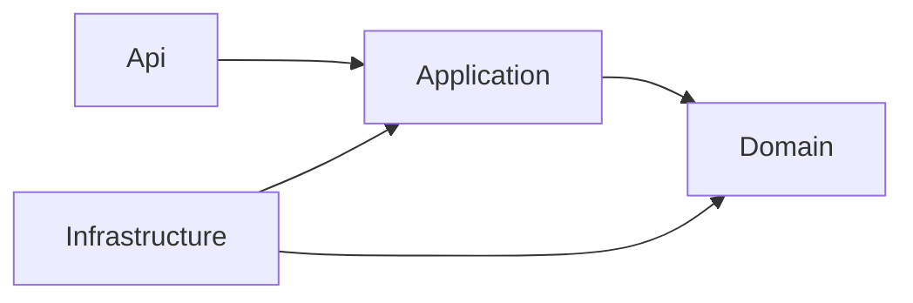

# Mimari Genel Bakış

← [İndeks](00-index.md)

> Teknoloji seçimleri öneridir; hoca görüşü ve takım/süre netleşince kesinleşir. Gerekçe: [ADR-01](adr/01-dart-backend-postgresql.md).

## Teknoloji tablosu

| Konu | Teknoloji | Açıklama |
| --- | --- | --- |
| İstemci | Flutter (Dart) | En fazla 6-7 ekran; mobil ve web |
| Backend | Dart, Shelf | Küçük ve anlaşılır çatı; akışı okunabilir tutar |
| Veritabanı | PostgreSQL 16 | Durum değişimi ve bildirimin aynı işlemde yazılması (ACID) için |
| Veritabanı erişimi | `postgres` paketi | Parametreli sorgu (SQL Injection'a karşı) |
| Şema yönetimi | Elle SQL dosyaları (`db/migrations/`) | Ek araç gerektirmez |
| Fotoğraf depolama | Sunucu diski, veritabanında yol | İlk sürüm için yeterli; canlıda kalıcı disk gerekir |
| Test | Dart `test` paketi, `mocktail` | Domain ve servis testleri; bir entegrasyon testi |
| Entegrasyon testi | Gerçek PostgreSQL konteyneri | Sahte veritabanı yerine gerçeği test eder |
| Konteyner | Podman, podman-compose | Docker yerine; aynı komut ve compose dosyası |
| Kod kalitesi | `dart analyze`, `flutter analyze`, `dart test --coverage`; Dart taraması için SonarQube Cloud (öneri) | Community'de Dart yok; Cloud denenmedi |
| Dağıtım | VPS üzerinde compose, HTTPS | Deneme ve demo için |

Paket sürümleri pub.dev üzerinde kontrol edildikten sonra bu tabloya eklenir.

## Katmanlar

`Domain`, `Application`, `Infrastructure`, `Api`.

- **Domain:** varlıklar, değer nesneleri, iş kuralları. Hiçbir katmana bağlı değildir.
- **Application:** kullanım senaryoları (servisler) ve arayüzler (ör. `ReportRepository`, `PhotoStorage`).
- **Infrastructure:** PostgreSQL ve dosya sistemi gerçeklemeleri.
- **Api:** HTTP endpoint'leri, kimlik doğrulama, hata eşleme.
- **Bağlama:** bağımlılıklar `main.dart` içinde verilir; somut sınıfı yalnızca orası bilir.

Zengin domain nesnesi: `private` alanlar, doğrulama `Create` fabrika metodunda; geçersiz nesne oluşamaz.

## Uyulacak ilkeler

- SOLID ilkeleri, Clean Code prensipleri
- Bir metot bir görev; iç içe koşul yerine erken çıkış
- Sabitler ve limitler kodun içine gömülmez (kampüs sınırı yapılandırmadan gelir)
- Beş ve üzeri parametre yerine istek nesnesi
- Sırlar yalnızca ortam değişkenlerinde ([güvenlik](06-security-and-privacy.md))

## API standartları

- RESTful; kaynaklar çoğul isimle (`/api/reports`)
- Listeleme endpoint'leri sayfalama destekler (`page`, `pageSize`)
- Oluşturma `POST`, güncelleme `PUT`
- Hata gövdesi tek biçimde: `{ "error": { "code", "message", "details" } }`
- JSON alanları `camelCase`

Ayrıntı: [API tasarımı](05-api-design.md).

## Dağıtım

VPS üzerinde `docker-compose.yml` ile backend ve PostgreSQL; fotoğraflar için kalıcı disk; HTTPS. Yapılandırma ve sırlar `.env` ile verilir, repo'ya girmez. Yerelde aynı dosya Podman ile çalışır.
