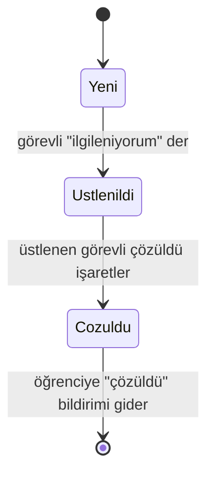

# Domain Tasarımı

← [İndeks](00-index.md)

## Durum akışı



`Cozuldu` son durumdur. Puan, yorum, `Kapandi` durumu ve yeniden açma ilk sürümde yoktur.

## User (Entity)

| Alan | Tip | Açıklama | Örnek | Kural |
| --- | --- | --- | --- | --- |
| userId | Guid | Benzersiz kimlik | 5c98741b-... | Tekrar etmez |
| fullName | Text | Ad soyad | Ayşe Yılmaz | 3-100 karakter |
| email | Text | Giriş e-postası | ayse@ornek.edu | Geçerli biçim, benzersiz |
| role | Role | Rol | Student | `Student` veya `Staff` |

## Report (Aggregate root)

| Alan | Tip | Açıklama | Kural |
| --- | --- | --- | --- |
| reportId | Guid | Benzersiz kimlik | |
| reporterId | Guid | Bildiren öğrenci | Zorunlu |
| assigneeId | Guid? | Üstlenen görevli | Sadece `Staff`; `Yeni` iken boş |
| category | Category | Sorun türü | `Ariza`, `Temizlik`, `Guvenlik`, `Diger` |
| description | Text | Açıklama | 5-500 karakter |
| photo | Photo | Fotoğraf | Zorunlu; jpeg veya png, en fazla 5 MB |
| location | Location | Konum | Zorunlu; kampüs sınırları içinde |
| status | ReportStatus | Durum | Yalnızca diyagramdaki geçişler |
| createdAt | DateTime | Oluşma zamanı | Sunucu atar |
| takenAt | DateTime? | Üstlenme zamanı | Üstlenince dolar |
| resolvedAt | DateTime? | Çözülme zamanı | Çözülünce dolar |
| resolutionPhoto | Photo? | Görevlinin çektiği sonuç fotoğrafı | `Cozuldu` iken **zorunlu**; diğer durumlarda boş |
| resolutionNote | Text? | Görevlinin notu | İsteğe bağlı, en fazla 500 karakter |

### Photo (Value object)

| Alan | Tip | Kural |
| --- | --- | --- |
| url | Text | Zorunlu; sunucunun ürettiği dosya adı |
| contentType | Text | `image/jpeg` veya `image/png` |
| sizeBytes | Int | En fazla 5 MB |

### Location (Value object)

| Alan | Tip | Kural |
| --- | --- | --- |
| latitude | Double | -90..90 |
| longitude | Double | -180..180 |
| place | Text? | En fazla 100 karakter (bina, kat, oda) |
| source | LocationSource | `Gps` veya `Building` |
| buildingId | Guid? | `Building` kaynağında zorunlu; konum binanın merkez koordinatıdır |

Konum GPS ile alınır; kullanıcı konum iznini vermezse bina listesinden seçer. İki durumda da sınır kontrolü sunucuda yapılır; istemciden gelen koordinata güvenilmez.

Kampüs sınırı bir dikdörtgen olarak yapılandırma dosyasında tutulur; koda gömülmez. Koordinatlar bu alanın dışındaysa bildirim oluşturulmaz.

## Building (Entity)

Konum izni verilmediğinde seçilen kampüs binası. Seed veriden yüklenir; ilk sürümde düzenleme ekranı yoktur.

| Alan | Tip | Kural |
| --- | --- | --- |
| buildingId | Guid | Benzersiz |
| name | Text | 2-100 karakter, benzersiz |
| latitude, longitude | Double | Kampüs sınırı içinde |

Gerçek kampüs sınırı ve bina listesi hafta 3'te belirlenir (Murat Yaman); o zamana kadar örnek değerler kullanılır.

## Notification (Entity)

Öğrenciye sistem içinde gösterilen haber. İlk sürümde tek tür: `ReportResolved`.

| Alan | Tip | Kural |
| --- | --- | --- |
| notificationId | Guid | Benzersiz |
| userId | Guid | Sorunu bildiren öğrenci |
| reportId | Guid | Zorunlu |
| type | NotificationType | `ReportResolved` |
| LocationSource | `Gps`, `Building` |
| message | Text | En fazla 200 karakter |
| createdAt | DateTime | Sunucu atar |
| readAt | DateTime? | Okununca dolar |

## StatusHistory (Entity)

Her durum değişimi denetim izi olarak kaydedilir: `reportId`, `from`, `to`, `changedBy`, `changedAt`, `note`.

## Enum'lar

| Enum | Değerler |
| --- | --- |
| Role | `Student`, `Staff` |
| Category | `Ariza`, `Temizlik`, `Guvenlik`, `Diger` |
| ReportStatus | `Yeni`, `Ustlenildi`, `Cozuldu` |
| NotificationType | `ReportResolved` |

## Kurallar (Rules)

| Kod | Kural |
| --- | --- |
| Rule 00 | Yalnızca `Staff` bildirimi üstlenebilir ve çözüldü işaretleyebilir. |
| Rule 01 | `Student` yalnızca kendi bildirimlerini ve kendi "çözüldü" bildirimlerini görür. |
| Rule 02 | Bir bildirimi aynı anda tek görevli üstlenir; ikinci istek `409` ile reddedilir. Veritabanında koşullu güncelleme ile sağlanır (`WHERE assigneeId IS NULL`). |
| Rule 03 | Çözüldü işaretini yalnızca üstlenen görevli yapar. |
| Rule 04 | Çözüldü işaretlemek için **sonuç fotoğrafı zorunludur** (Rule 07 kuralları geçerli). `Cozuldu` olunca sorunu bildiren öğrenciye bir kez "çözüldü" bildirimi oluşur; öğrenci sonuç fotoğrafını bildirim detayında görür. Durum değişimi, durum geçmişi ve bildirim aynı işlemde (transaction) yazılır. |
| Rule 05 | Durum geçişleri diyagram dışına çıkamaz; geçersiz geçiş hata döner. |
| Rule 06 | Konum kampüs dışındaysa bildirim oluşturulmaz. Bina kaynağında konum, kayıtlı bina koordinatıdır; listede olmayan bina reddedilir. |
| Rule 07 | Fotoğraf yalnızca jpeg veya png, en fazla 5 MB; dosya adını sunucu üretir; EXIF verisi temizlenir. |

## Örnek veri (sahte)

```json
{
  "reportId": "d4816d0a-cd8e-4442-98c0-65d3ba11be70",
  "reporterId": "5c98741b-64c8-49de-9e68-3d7a2f44802b",
  "assigneeId": null,
  "category": "Ariza",
  "description": "B blok 2. kat koridor lambası yanmıyor",
  "photo": { "url": "/files/lamba.jpg", "contentType": "image/jpeg", "sizeBytes": 812345 },
  "location": { "latitude": 36.5871, "longitude": 36.1742, "place": "B Blok 2. kat" },
  "status": "Yeni",
  "createdAt": "2026-10-02T09:15:00Z",
  "takenAt": null,
  "resolvedAt": null
}
```

Koordinatlar örnektir; gerçek kampüs sınırı değildir.

## Test edilecekler

- Her kural için en az bir test (yanlış rol, geçersiz geçiş, kampüs dışı konum, bilinmeyen bina, sonuç fotoğrafı olmadan çözme, ikinci görevli).
- Sıfır veri testi: hiç bildirim yokken listeler boş döner.
- Yarış durumu testi: iki görevli aynı anda üstlenmeye çalışınca yalnızca biri başarılı olur.
