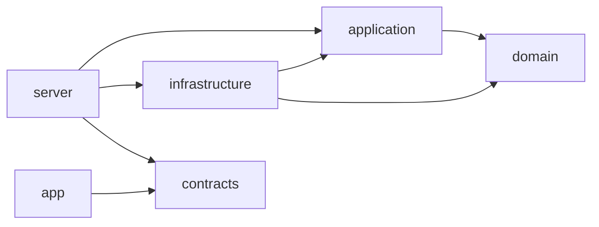

# Kod Mimarisi ve Korumalar

← [İndeks](00-index.md)

Bu doküman kodun **nasıl bölündüğünü** ve kuralların **insan dikkatine değil araçlara** nasıl emanet edildiğini anlatır. Amaç: ekipte kim ne yazarsa yazsın, mimariyi bozan ya da iş kuralını çiğneyen kod `main`'e giremesin. Katmanların anlamı: [Mimari genel bakış](02-architecture-overview.md). Kurallar: [Domain tasarımı](03-domain-design.md#kurallar-rules). İş bölümü: [Ekip ve yol haritası](10-ekip-ve-yol-haritasi.md).

## 1. Repo yapısı

Tek repo, Dart **pub workspace** (tüm paketler tek `pub get` ile çözülür, tek `pubspec.lock`).

```text
kampus-bildirim-sistemi/
├── pubspec.yaml                 # workspace kökü: paket listesi, ortak geliştirme bağımlılıkları
├── analysis_options.yaml        # ortak analiz kuralları
├── test/architecture_test.dart  # mimari koruma testi (import ve bağımlılık kontrolü)
├── AGENTS.md                    # yapay zeka araçlarına verilen proje kuralları (herkes için)
├── CLAUDE.md                    # yalnızca AGENTS.md'yi içeri alır
├── .github/                     # CI, CODEOWNERS, PR ve issue şablonları
├── db/migrations/               # elle yazılan SQL dosyaları (sıra numaralı)
├── db/seed/                     # sahte örnek veri
├── compose.yaml                 # PostgreSQL (yerel geliştirme ve entegrasyon testi)
├── packages/
│   ├── domain/                  # campus_domain
│   ├── application/             # campus_application
│   ├── contracts/               # campus_contracts
│   ├── infrastructure/          # campus_infrastructure
│   ├── server/                  # campus_server
│   └── app/                     # campus_app (Flutter, Android)
└── proje-bilgileri/             # dokümantasyon
```

## 2. Paketler ve izinli bağımlılıklar

| Paket | Klasör | Neyi içerir | Hangi paketlere bağlanabilir | Sahibi |
| --- | --- | --- | --- | --- |
| `campus_domain` | `packages/domain` | Varlıklar, değer nesneleri, enum'lar, kurallar (Rule 00-07), domain hataları | **Hiçbiri** (yalnızca Dart çekirdeği; `dart:io` yasak) | Hüseyin Emre |
| `campus_application` | `packages/application` | Kullanım senaryosu servisleri, repository ve depolama arayüzleri, `Result` ve uygulama hataları | `campus_domain` (`dart:io` yasak) | Hüseyin Emre |
| `campus_contracts` | `packages/contracts` | API istek/yanıt sınıfları (JSON), hata kodları, enum metinleri | **Hiçbiri** (`dart:io` yasak) | Hüseyin Emre (yazımı Murat Yaman) |
| `campus_infrastructure` | `packages/infrastructure` | PostgreSQL repository'leri, dosya depolama, EXIF temizleme, parola hash | `campus_domain`, `campus_application`, dış paketler | Ertuğrul Pekdemir |
| `campus_server` | `packages/server` | Shelf endpoint'leri, kimlik doğrulama ara katmanı, hata eşleme, `bin/main.dart` (tek bağlama noktası) | Hepsi | Murat Yaman |
| `campus_app` | `packages/app` | Flutter ekranları, API istemcisi | **Yalnızca** `campus_contracts` ve Flutter paketleri | Yusuf Ekenel, Murat Yaman, Ertuğrul Pekdemir |



Neden `contracts` ayrı: uygulamayı yazanlar domain sınıflarına hiç erişemez, iş kuralını ekranda yeniden yazamaz. API'nin JSON biçimi tek yerde tanımlıdır; sunucu ve uygulama aynı sınıfı kullandığı için alan adı uyuşmazlığı derleme hatası olur.

## 3. Koruma katmanları

Her satır bir hata türünü kapatır. Hiçbiri "dikkatli olun" demez; hepsi ya derlemeyi ya CI'ı kırar.

| # | Koruma | Kapattığı hata | Nasıl çalışır |
| --- | --- | --- | --- |
| K1 | Paket bağımlılıkları | Katman ihlali | `domain` paketinin `pubspec.yaml`'ında bağımlılık yoktur; başka paketi import eden kod derlenmez |
| K2 | Mimari test (`test/architecture_test.dart`) | Katman ihlali, yanlış `pubspec` eklemesi | Her paketin `lib/` altındaki import'ları ve `pubspec.yaml` bağımlılıkları bölüm 2'deki tabloyla karşılaştırılır; `domain`, `application`, `contracts` içinde `dart:io` aranır. Uymayan CI'ı kırar |
| K3 | Hataya kapalı domain | İş kuralı bozulması | Yapıcılar özel; nesne yalnızca `Report.create(...)` ile oluşur; alanlar `final`, setter yok; durum yalnızca `assign`, `resolve` metotlarıyla değişir ve geçersiz geçişte hata döner |
| K4 | `sealed` hata tipleri ve `switch` | Unutulan hata eşlemesi | Uygulama hataları `sealed class AppError` altındadır; sunucudaki eşleme `switch` ifadesidir. Yeni hata eklenip HTTP karşılığı yazılmazsa derleme hatası olur |
| K5 | Önceden yazılmış kabul testleri | Kuralın yanlış anlaşılması | Her kullanıcı hikayesinin testlerini Hüseyin Emre görevden önce yazar ve `@Tags(['bekliyor'])` ile işaretler. CI bu etiketi atlar. Görevi alan kişi testi yeşile çevirir ve etiketi kaldırır |
| K6 | CI | Bozuk kodun `main`'e girmesi | Her PR'da: biçim, `dart analyze --fatal-infos`, mimari test, tüm paketlerin testleri. Biri kırmızıysa birleştirme düğmesi kapalı |
| K7 | `main` koruması | Git kaosu | Doğrudan push yok, PR zorunlu, 1 onay, yeni commit gelince onay düşer, açık yorum varken birleşmez, yalnızca squash, force-push ve silme kapalı (2 Ekim 2026'da kuruldu) |
| K8 | `CODEOWNERS` | Çekirdeğe habersiz değişiklik | `packages/domain`, `packages/application`, `packages/contracts`, `test/`, `.github/`, `AGENTS.md`, `analysis_options.yaml` değişirse Hüseyin Emre'nin onayı zorunlu |
| K9 | Görev kartı (issue şablonu) | Kapsam dışına taşma | Her görevde: kabul ölçütü, dokunulacak dosyalar, **dokunulmayacak dosyalar**, bağlı testler |
| K10 | PR şablonu | Anlaşılmadan alınan AI kodu | Her PR'da "ne yaptım, AI'a ne sordum, neyi değiştirdim, hangi satırı anlatamıyorum" bölümleri; inceleyen en az bir "bu satır neden böyle?" sorusu sorar, yazar cevaplar |
| K11 | `AGENTS.md` | AI aracının mimariyi bozması | Ekipteki herkesin AI aracı aynı kural dosyasını okur: katman tablosu, yasaklar, test zorunluluğu, küçük parça kuralı |

## 4. Domain'in hataya kapalı biçimi

Örnek, üstlenme kuralı (Rule 00, 02, 05):

```dart
// packages/domain/lib/src/report/report.dart (taslak; hafta 4-5'te yazılır)
final class Report {
  Report._({required this.id, required this.reporterId, required this.status, this.assigneeId});

  final ReportId id;
  final UserId reporterId;
  final ReportStatus status;
  final UserId? assigneeId;

  /// Görevli bildirimi üstlenir. Geçersizse nesne değişmez, hata döner.
  ReportResult assign(Actor actor) {
    if (actor.role != Role.staff) return const ReportResult.failure(DomainError.onlyStaff);
    if (status != ReportStatus.yeni) return const ReportResult.failure(DomainError.invalidTransition);
    return ReportResult.success(_copy(status: ReportStatus.ustlenildi, assigneeId: actor.userId));
  }
}
```

Kurallar:
- Domain hiçbir zaman istisna (exception) fırlatarak akış kontrol etmez; sonuç tipi döner.
- Domain saati kendisi okumaz; zaman `Clock` arayüzüyle verilir (testlerde sabit saat).
- Rule 02'nin **eşzamanlı** kısmı domain'de değil veritabanındadır: `UPDATE reports SET ... WHERE id = $1 AND assignee_id IS NULL`. Etkilenen satır 0 ise `409`.

## 5. Konum

GPS ile alınır; konum izni verilmezse **bina listesinden** seçilir.

| Kaynak | Uygulama ne gönderir | Sunucu ne yapar |
| --- | --- | --- |
| `gps` | `latitude`, `longitude`, `place` (yer tarifi, ör. "B Blok 2. kat") | Kampüs sınırı içinde mi diye kontrol eder (Rule 06); dışındaysa `422 OUTSIDE_CAMPUS` |
| `building` | `buildingId`, `place` | Binanın kayıtlı merkez koordinatını konum olarak yazar; bina listesi sunucudadır (`GET /api/buildings`) |

İstemciden gelen konuma güvenilmez: sınır kontrolü her zaman sunucuda yapılır. Kampüs sınırı ve bina listesi yapılandırma ve seed verisidir, koda gömülmez.

## 6. Test düzeni

| Tür | Nerede | Etiket | CI'da |
| --- | --- | --- | --- |
| Domain birim testleri | `packages/domain/test/` | - | Her PR |
| Servis testleri (sahte repository ile) | `packages/application/test/` | - | Her PR |
| Kabul testleri (önceden yazılmış) | İlgili paketin `test/kabul/` klasörü | `bekliyor` (görev bitince kaldırılır) | Etiketsizler her PR |
| Entegrasyon testleri (gerçek PostgreSQL) | `packages/infrastructure/test/` | `db` | PostgreSQL servis konteyneriyle (hafta 4'te eklenir) |
| Sunucu testleri (HTTP) | `packages/server/test/` | - | Her PR |
| Widget testleri | `packages/app/test/` | - | Her PR |
| Mimari test | `test/architecture_test.dart` | - | Her PR |

Adlandırma: `metot_senaryo_beklenenSonuc` biçiminde açıklama, gövde Arrange / Act / Assert. Kapsam hedefi: `domain` ve `application` için %90, genel %70 (hafta 12'de ölçülür).

## 7. Bilinçli olarak eklenmeyenler

| Eklenmeyen | Neden |
| --- | --- |
| Durum yönetimi paketi (Riverpod, Bloc) | Ekranlar az ve basit; Flutter'ın kendi `ChangeNotifier` ve `ListenableBuilder`'ı yeter, öğrenme yükü azalır |
| Kod üretimi (`json_serializable`, `freezed`) | `fromJson`/`toJson` elle yazılır; üretilen kod yeni üyelerin anlatamayacağı satırlar demektir |
| ORM | Parametreli SQL okunur ve hocaya anlatılır; Rule 02 koşullu güncellemesi açıkça görünür |
| Bağımlılık enjeksiyonu paketi | Bağlama tek dosyada (`bin/main.dart`) elle yapılır |

## 8. Doğrulanmayanlar

Hafta 3-4'te küçük denemeyle doğrulanıp sonuç [teknoloji değişiklikleri](kayitlar/teknoloji-degisiklikleri.md) dosyasına yazılır:

- Flutter paketinin pub workspace içinde sorunsuz çalıştığı (Flutter 3.27 ve sonrası destekliyor, bizde denenmedi).
- `postgres`, `shelf`, `shelf_router`, parola hash ve EXIF temizleme için seçilecek paketlerin güncelliği ve bakım durumu (pub.dev'de kontrol edilecek).
- Konum ve kamera için seçilecek Flutter paketlerinin Android 36 SDK ile uyumu.
